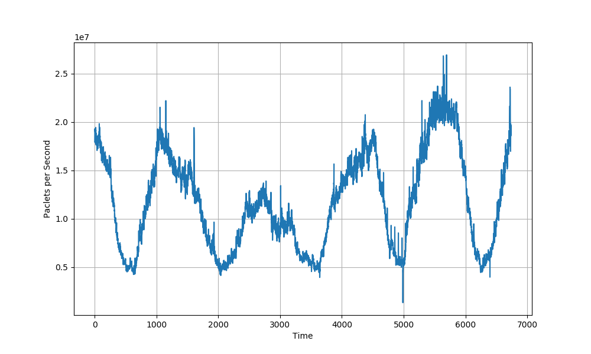

# Network-Traffic-Prediction
Real-Time Network Traffic Volume Prediction using time series and recurrent neural network

>## Introduction:
>With the rapid growth of Internet Technology, network traffic is growing exponentially. As a result, the resource management is becoming more difficult and more complex for Internet
service providers. Hence, current traditional models cannot forecast network traffic that acts as a nonlinear system. In this chapter, we propose to leverage the emerging deep learning
techniques to predict network traffic. Extensive experiments were conducted to evaluate the performance of the proposed models using real-world data and we compare the accuracy of the
chosen model with a baseline model named Support Vector Regression (SVR).

>## Exploratory Data Analysis:
> ### 1. Data Collection:
>In order to implement a predictive model, there is always a mandatory step which is choosing the right data set for both training and evaluation. In fact, we have used a real traffic data
taken from the University of Leipzig Internet access link [1]. A pair of DAG 3.2 cards were used to monitor network traffic from campus network to the German research network (G-WiN). A
diagram of the configuration is illustrated in figure below:
> 
>After selecting the data source, we have chosen the traffic that is directed from the German research network to the campus network with a duration of 4 days and 18 hours. Thus, all
outer connections pass through this measurement point.
In addition, all non-IP traffic has been removed, and only TCP, UDP and ICMP traffic are kept in the traces. Then, all IP addresses have been anonymised using one-to-one mapping into
another address space.

> ### 2. Data Preprocessing:
>At first, we have converted the traces from compressed format into PCAP files using Libtrace tool [6] in order to make them readable . Thus, The collected raw data set consists of network
packets in PCAP format. The network traffic captured 3429 million packets over 4 days and 18 hours. In fact, the storage of this traffic was about 1615 GB.
Hence, we processed the data in order to transform it into a time series that represents the length of packets at each minute. This resulted in a time series containing 6839 values as
illustrated in the figure below. This part of the process was done using Bash scripts in order to optimize the execution time.
Indeed, this data was sufficient to implement our network traffic prediction because we notice that it’s about a periodic curve where the long term regularities are evident.

> ### 3. Data Normalization:
>Training of ML algorithms often performs better with standardized input data. In fact, normalizing features is not only essential for comparing features with different scales, it is a
common prerequisite for many machine learning algorithms. For instance, in the absence of normalizing features for optimization algorithms, some weights may update faster than others
as feature values plays a role in updating weights.
Hence, we apply the Gaussian transformation (i.e. subtracting the mean and dividing by the standard deviation).

> ### 4. Data Transformation:
>Time Series prediction requires a set of past observations in order to estimate future values of the features of interest. Actually, there are mainly two categories as explained below:
>* **One-Step Prediction**:
The most straightforward strategy is one step prediction which is about taking a vector that include the last observations as input to the model responsible for yielding the
prediction. Specifically, for a set of samples observed at times t0; t1; ...; tn, the value at time tn+1 is estimated.
>* **Multi-Step Prediction**:
Multi-Step Prediction is about predicting upper than one step ahead based on the same
historical samples. Specifically, for a set of samples observed at times t0; t1; ...; tn, the values at time tn+1; tn+2; ...; tn+m are estimated.

> ## Training and Evaluation:
>At first, the data set was divided into two parts, as indicated below, using Test-Set Validation technique which is the most basic strategy for estimating the reliability and the robustness
of the predictive models. Indeed, we split the data into two separate portions:
>* **Training Set:** It contains 80% of the original data. Hence, this portion will be used for
training the predictive models.
>* **Test Set:** It contains 20% of the original data. Hence, the fitted models will be validated
on the Test Set.
>Then, we turn our focus on the model architecture of each forecasting model.
We have used two variants of RNN:
>* Long Short Term Memory (LSTM)
>* Gate Recurrent Unit (GRU)
>The proposed architecture of the two RNN variants has the same number of layers as depicted
below:
>* **Encoder:** The encoder consists of a single layer containing 16 (LSTM / GRU) neurons.
>Indeed, it is responsible for encoding the time series to the state of the network.
> * **Decoder:** The decoder consists of four consecutive layers where each layer contain by default 8 (LSTM / GRU) neurons. This will decode the encoding vector in order to generate the output sequence.
>In order to set the optimal weights of the chosen RNN models and minimize the error rate between the actual output and the predicted sequence, a loss function is required. In the
literature, the most used loss function for regression problems is Mean Squared Error (MSE).